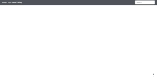
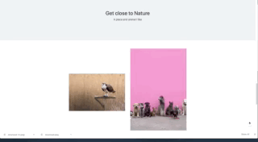

  

  

## Getting Started

Git clone https://github.com/Zowie0122/upsplashGallery.git

Create a file under the root folder named next.config.js

Inside of the next.config.js,add the followings with your own Unsplash client key and MongoDB key.

module.exports = {
env: {
MONGO_URI:
"mongodb+srv://<your user name>:<your password>@<your cluster name>.xq62e.mongodb.net/<your db name>?retryWrites=true&w=majority",
UNSPLASH_API_KEY: <your client key>,
},
};

If you want to limit how many photos you fetch from Unsplash, you can replace "1" with the number you prefer in index.js line 36.

Save the file run command Yarn and Yarn Dev

Go to localhost:3000

## Q&A

Q :Do you have any strong rationale for why you chose specific development technologies for
this project that you would like to share with the team?

A :I prefered to use MongoDB instead of web browser local storage. Since it is what the team is using and also as the data grow bigger, the speed may go down.

Q: Do you have any strong rationale for why you made specific design decisions (software
architecture design) over alternatives?

A: Within limited time, I wanted to set up the server as quick as possible, that is why I chose Next.js, since it is very easy and quick to set up a server.

Q: Do you have any strong rationale for why you made specific implementation decisions over
alternatives?

A: I did not made specific implementation. I added Narbar only, to make user easier to switch to different pages.

Q: [Optional] What else would you like to improve if you have more time? This can be in simple
format like a TODO bullet points

A: I would like to display the gallery in slides and 3D. I would also like to improve the UI/UX.

Q: [Optional] If you feel like there are things you’d like to implement and/or fix, feel free to add a
TODO section in your documentation

A: - Remove a list - Add user login
